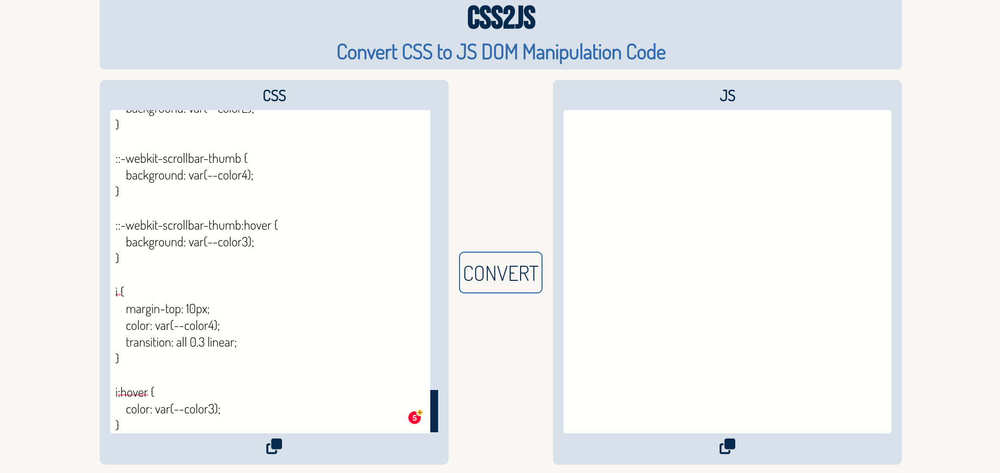
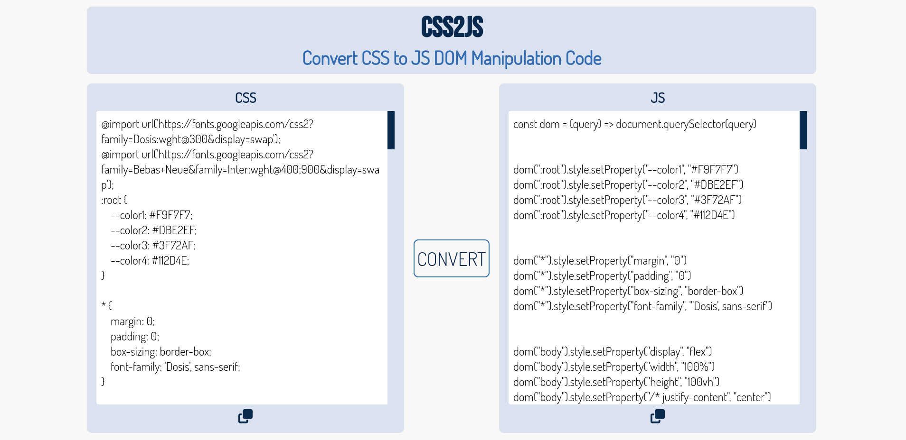

# CSS2JS
An app to convert simple CSS code to Javascript DOM Manipulation code.


## Demo
You can checkout a demo of the website [here](https://css2js.vercel.app/).



## Run Locally

Clone the project

```bash
  git clone https://github.com/anmoljhamb/CSS2JS.git
```

Go to the project directory

```bash
  cd CSS2JS
```

Install dependencies

```bash
  npm install
```

Start the server

```bash
  npm start
```

The server will be run with `nodemon`.

## Screenshot

## Tech Stack

**Client:** CSS, JS

**Server:** Node, Express


## Todo

Things that need to be fixed or added.
- Currently, the app doesn't support events. So, `selector:hover` wouldn't really work.
- The Script doesn't allow for multiple selections at the same time. `selector1, selector2 {}`
## Feedback

If you have any feedback, please reach out to me at talktoanmol@outlook.com

